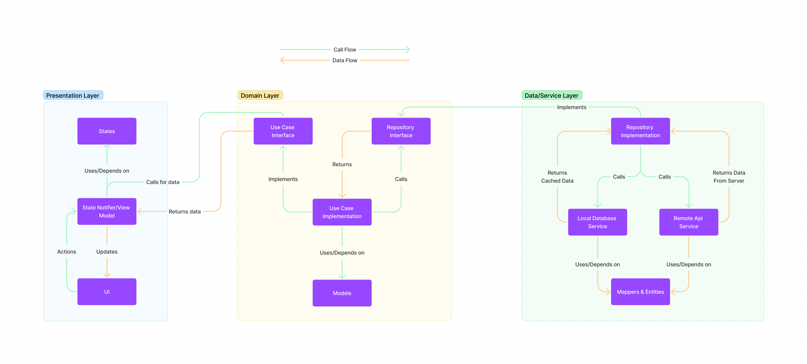

# todo_app_clean_architecture

A simple todo app which implements clean architecture + MVVM design pattern using Riverpod as a State
Management tool. This repository can be a reference for other projects.

## Architecture Diagram



## Project Structure

This project follows a feature first project structure. This means the app is segmented by features and
each features contains data, domain and presentation layers.

```bash
└───lib
    ├───i10n
    ├   ├───generated
    ├   ├───locales
    │   └───providers
    └───src
        ├───application
        ├   ├───design_system
        ├   ├   ├───design_system
        ├───core
        │   ├───common_widgets
        │   ├───constants
        │   ├───errors
        │   ├───helpers
        │   └───usecases
        ├───features
        │   ├───authentication
        │   │   ├───data
        │   │   │   └───repositories
        │   │   ├───domain
        │   │   │   ├───repositories
        │   │   │   └───usecases
        │   │   └───presentation
        │   │       ├───screens
        │   │       └───viewmodels
        │   └───todo
        │       ├───data
        │       │   └───models
        │       ├───domain
        │       │   └───entities
        │       └───presentation
        │           ├───pages
        │           └───widgets
        └───l10n
```